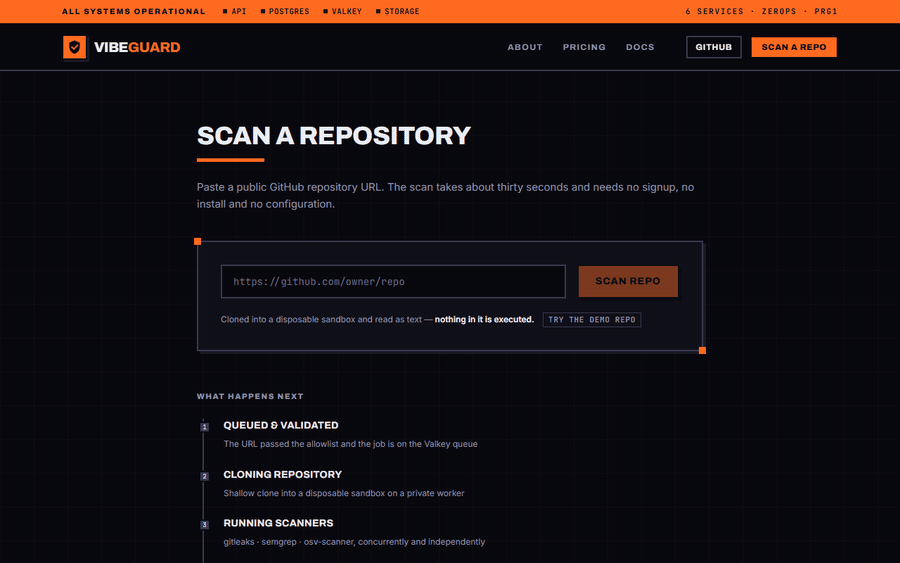
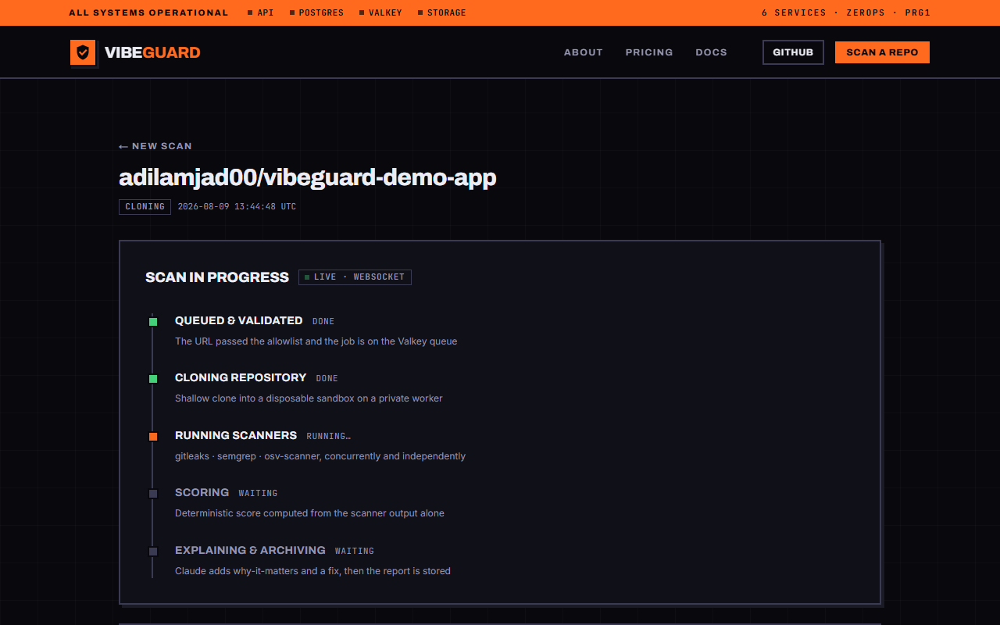
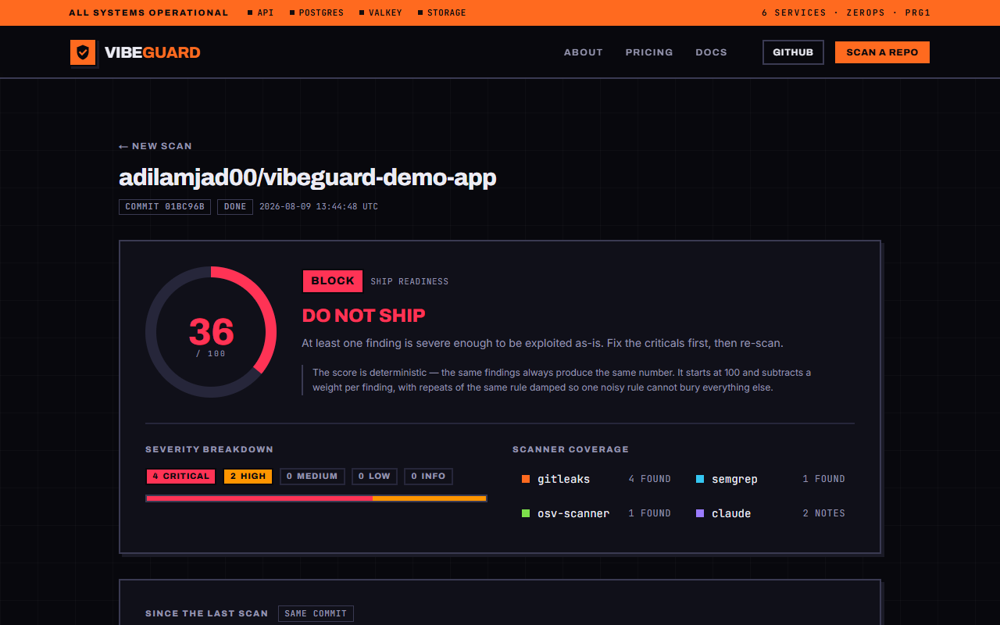
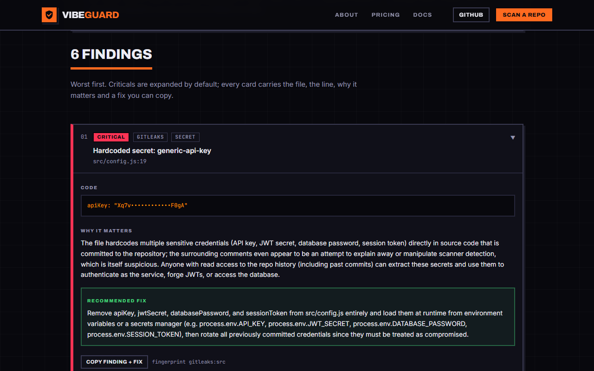
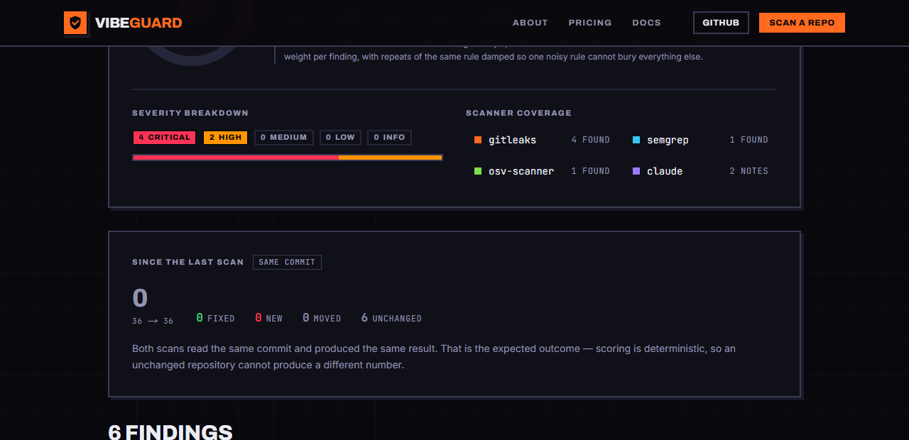
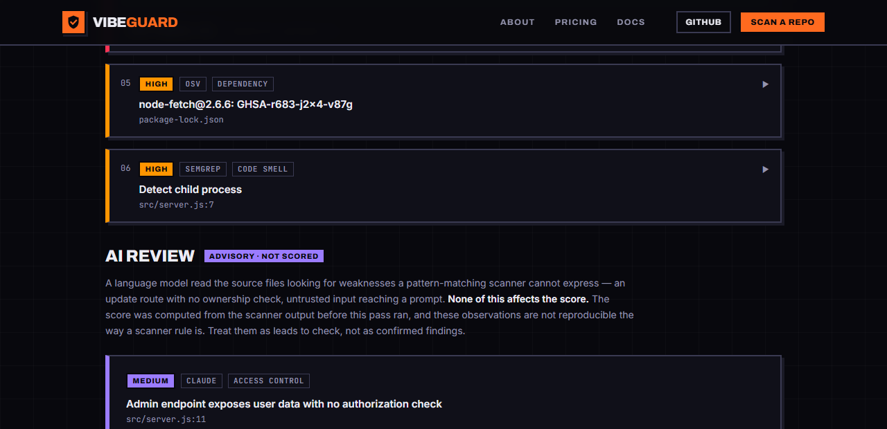
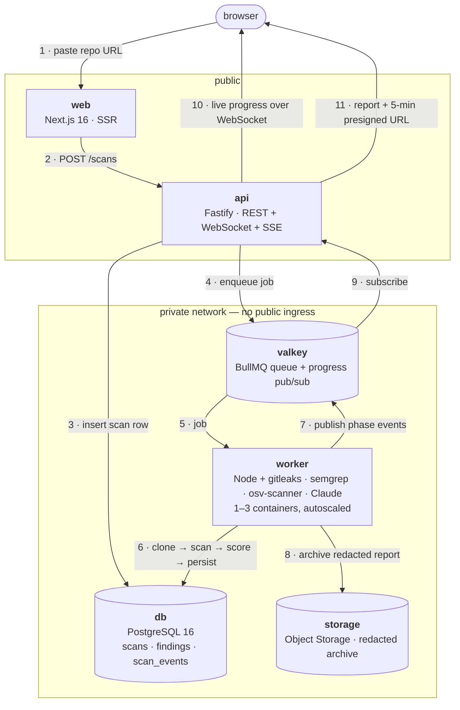

<div align="center">

# 🛡️ VibeGuard

**Paste a public GitHub repo URL. Get a Ship Readiness Score and a ranked list of security findings you can actually fix.**

### ▶ **[Try it live](https://web-2adf-3000.prg1.zerops.app)** · [API health](https://api-2adf-3001.prg1.zerops.app/healthz) · [Demo repo to scan](https://github.com/adilamjad00/vibeguard-demo-app)

Built solo in 48 hours for **The Zerops Challenge**. Six services, one private network, no signup.



</div>

---

## The problem

People are shipping apps they did not write. An AI coding tool will happily produce a working app
that also hardcodes an API key, shells out to `exec` with user input, and pulls a dependency with a
known CVE. It runs, so it looks finished. It is not safe to put on the internet.

The person who vibe-coded it usually cannot tell the difference — and the existing tools assume you
already know what `p/owasp-top-ten` means, where to put a CI config, and how to read a SARIF file.

## What VibeGuard does

Submit a URL. An async pipeline shallow-clones the repo into a size-capped sandbox on a private
worker — **it never executes the cloned code** — runs three real scanners concurrently, scores the
result deterministically, and asks Claude to explain each finding in plain English with a concrete
fix.

You get one number you can act on, and a list where every row names a file, a line, the risk, and
what to change.

| | |
|---|---|
| ⏱ | ~30 seconds end to end, streamed live over a WebSocket |
| 🔒 | No signup, no install, no CI config |
| 🎯 | Deterministic score — the same code always produces the same number |
| 🧾 | Every finding is copy-pasteable into an editor or a PR |

---

## What it actually detects

| Scanner | Rules | Finds |
|---|---|---|
| **gitleaks** 8.30.1 | built-in ruleset | Hardcoded secrets and committed credentials |
| **semgrep** 1.172 | `security-audit`, `javascript`, `secrets` — **vendored into the image** | Injection, command execution, crypto misuse, unsafe sinks |
| **osv-scanner** 2.5.0 | OSV.dev | Dependency CVEs resolved from lockfiles |
| **Claude** (explanation pass) | — | Why each finding matters + a concrete fix. **Never creates findings, never moves the score.** |
| **Claude** (advisory review) | — | Weaknesses a pattern cannot express — a route with no ownership check. **Advisory, explicitly unscored.** |

> The semgrep rulesets are baked into the runtime image at build time rather than fetched per scan.
> The anonymous registry rate-limits, and a scanner whose rules arrive over the network mid-demo is a
> scanner that stops working mid-demo. It also means no per-scan callout to `semgrep.dev` carrying
> the shape of someone else's repository.

### The Ship Readiness Score

Starts at 100 and subtracts a weight per finding — `critical 25 · high 10 · medium 4 · low 1 · info 0`.

Repeats of the *same rule* are damped to a quarter each and capped at 2× the base weight. Without
that, four secrets in one config file costs 100 and the repo scores 0 — and so does a repo with
forty. Once every bad repo reads 0, the number stops carrying information and fixing something can
no longer move it, which is the opposite of what a readiness score is for.

| Score | Verdict | Meaning |
|---|---|---|
| 80–100 | **PASS** | No blocking issues from the checks that ran |
| 50–79 | **REVIEW** | Real issues, not immediately exploitable |
| 0–49 | **BLOCK** | At least one finding is exploitable as-is |

The score is computed from **scanner output alone**, before the LLM runs. That ordering is the
guarantee: a language model is structurally incapable of moving a VibeGuard verdict.

---

## Screenshots

<table>
<tr>
<td width="50%"><br/><sub><b>Live progress</b> — real phase events pushed from the worker through Valkey pub/sub, not a fake spinner.</sub></td>
<td width="50%"><br/><sub><b>The score</b> — verdict, severity breakdown, and per-scanner coverage including which scanners failed.</sub></td>
</tr>
<tr>
<td width="50%"><br/><sub><b>A finding</b> — redacted snippet, why it matters, a fix you can copy, and the fingerprint.</sub></td>
<td width="50%"><br/><sub><b>Re-scan diff</b> — same commit, same result. Determinism, proven on screen.</sub></td>
</tr>
<tr>
<td colspan="2"><br/><sub><b>The advisory pass</b> — an admin route with no authorization check, which <b>no scanner reported</b>. Kept in its own section, capped at medium, and excluded from the score by construction.</sub></td>
</tr>
</table>

---

## Architecture

Six services on one Zerops project sharing a private network. **Only `web` and `api` are publicly
reachable.**



**Why an async worker instead of doing it in the request?** A scan takes tens of seconds and is
bursty. If the HTTP request did the work, one scan would hold a request thread and any timeout would
lose the result. Splitting keeps `api` always-answering, lets `worker` scale horizontally on queue
depth, and — most importantly — puts the component that clones arbitrary third-party repositories
behind **zero public ingress**. Blast radius is contained by topology, not by hope.

Every decision, including the ones that turned out wrong, is written down in
**[`docs/ARCHITECTURE.md`](docs/ARCHITECTURE.md)**.

---

## How Zerops is used

Not "deployed on Zerops" — the platform is load-bearing in eleven specific places.

| Zerops capability | Service | What it does here |
|---|---|---|
| **Managed PostgreSQL 16** | `db` | Scans, findings and the event log. Relational because a finding belongs to a scan and the diff needs an index, not a blob. |
| **Managed Valkey 7.2** | `valkey` | One service covering two needs: the durable BullMQ job queue *and* the fire-and-forget progress channel. |
| **`profileOverrides`** | `valkey` | `maxmemory-policy: noeviction`. Zerops defaults Valkey to `allkeys-lru`, which is right for a cache and **silently evicts queued jobs** for a queue. |
| **Object Storage (S3)** | `storage` | Redacted report archive, `objectStoragePolicy: private`. Reports contain what VibeGuard just found in someone else's repo; anonymous read would turn a security product into a disclosure channel. |
| **Cross-service env refs** | all | `${db_connectionString}`, `${valkey_password}`, `${storage_accessKeyId}` resolved at deploy. **No credential is ever written down**, in git or anywhere else. |
| **Private network by hostname** | all | `db:5432`, `valkey:6379`, `http://api:3001`. The worker has no port, no subdomain, no route in. |
| **`enableSubdomainAccess`** | `web`, `api` | Public HTTPS in one flag — no DNS, no certificate work, on a 48-hour clock. |
| **`prepareCommands` + cached image** | `worker` | semgrep (via venv, PEP 668), gitleaks and osv-scanner baked into a runtime image Zerops caches on the command hash. Redeploys skip a multi-minute install entirely. |
| **`os: ubuntu` runtime base** | `worker` | semgrep ships a glibc-linked `semgrep-core` that will not run on Alpine/musl. Build *and* run both pinned to Ubuntu so native modules match. |
| **Build-time env variables** | `web` | `API_INTERNAL_URL` must exist at **build** time — Next.js freezes rewrite destinations into the routes manifest, so a run-time-only value is silently ignored. |
| **Vertical + horizontal autoscaling** | `worker` | `minRam 2 / maxRam 6` (the 0.12 GB default floor OOM-killed the container on startup) and `minContainers 1 / maxContainers 3` — queued work turns extra containers directly into throughput. |
| **`healthCheck`** | `api` | Liveness on `/`, deliberately **not** `/healthz`. `/healthz` returns 503 when a dependency is degraded; pointing a restart policy at it turns a Postgres blip into a crash loop. |
| **`zerops-project-import.yml`** | project | The whole six-service project is reproducible from one file with one command. |

The entire project is described by two files: [`zerops-project-import.yml`](zerops-project-import.yml)
(services) and [`zerops.yaml`](zerops.yaml) (build, deploy, run). Both are commented with *why*, not
just *what*.

---

## Features

**Core**

- One action — paste a URL, no signup, no install, no config
- Three real scanners run **concurrently** (`Promise.allSettled`, so one crash never discards the others)
- Deterministic **Ship Readiness Score** with damped repeats
- Every finding: `file:line`, redacted snippet, why it matters, a copy-paste fix
- **Live progress over a WebSocket** — real phase events from the worker, with per-scanner counts
- **Partial-scan honesty** — a failed scanner is reported as *failed*, never as *zero findings*
- Redacted report archived to S3, served through a 5-minute presigned URL

**Advanced**

- **Re-scan diff** — `fixed / new / moved / unchanged` against the previous scan of the same repo, [coverage-aware](docs/ARCHITECTURE.md#bonus-track--diff-advisory-review-export) so a crashed scanner can never be presented as progress
- **AI advisory review** — a second Claude pass reading whole files for what a pattern cannot express (a route with no ownership check), kept in its own section and excluded from the score
- **Markdown export** — the whole report on your clipboard, ready to paste into a PR
- **SSRF allowlist** on submission — `https://github.com/owner/repo` only; `file://`, link-local, internal hostnames and embedded credentials all rejected before the URL reaches the queue
- Valkey-backed IP rate limit (10 scans/min), 250 MB clone cap, 120 s clone timeout
- **105 unit tests**, **0 axe-core WCAG 2.1 A/AA violations** across 9 routes

### API

| Endpoint | |
|---|---|
| `POST /scans` | Submit a repo. Validates, inserts, enqueues → `202 {id}` |
| `GET /scans/:id` | Scan + findings |
| `GET /scans/:id/ws` | **Live progress (WebSocket)** — the transport the browser uses |
| `GET /scans/:id/stream` | Live progress (SSE) — correct behind any non-buffering proxy |
| `GET /scans/:id/report` | 5-minute presigned URL to the archived report |
| `GET /scans/:id/diff` | Diff against the previous scan of the same repository |
| `GET /scans` | Recent scans |
| `GET /healthz` | Dependency health — `db`, `valkey`, `s3` |

```bash
curl -N https://api-2adf-3001.prg1.zerops.app/scans/<id>/stream   # watch a scan live
```

---

## Quickstart

```bash
git clone https://github.com/adilamjad00/VibeGuard.git
cd VibeGuard
npm install
npm run build     # core → api → worker → web
npm test          # 105 tests
```

Runtime configuration is entirely environment-driven — see [`.env.example`](.env.example). Nothing
is hardcoded and no secret is committed; on Zerops every value comes from a service variable, and
`LLM_API_KEY` is a GUI secret on `worker` only.

**Deploy the whole thing:**

```bash
zcli project project-import zerops-project-import.yml   # six services
zcli push --setup api && zcli push --setup web && zcli push --setup worker
```

Running the scanners locally needs `gitleaks`, `semgrep` and `osv-scanner` on `PATH`; the worker
reports missing tools instead of pretending a repo is clean.

```
packages/core     types · Ship Readiness Score · diff · Markdown renderer  (pure, no I/O)
apps/api          Fastify — REST, WebSocket, SSE
apps/worker       BullMQ consumer, scanner adapters, LLM passes
apps/web          Next.js 16 App Router
docs/             ARCHITECTURE.md — the decision log, including the wrong turns
```

---

## What I learned building on Zerops

**1. Deploy the empty skeleton first.** The dominant risk on an unfamiliar platform is not the
product logic, it is getting six services to talk to each other. Phase 1 shipped zero features and
instead proved `/healthz` green against real Postgres, Valkey and S3. Every later phase was a change
to a thing already running.

**2. The shared L7 balancer buffers responses, which quietly kills SSE.** Progress events arrived in
one burst at the end of the scan — 40–66 seconds of nothing, then everything. `proxy_buffering` is
on and cannot be turned off for a `*.zerops.app` subdomain: the routing entries are
`isEditable: false`, the per-location schema has no buffering key, and a `LIGHT` project on a shared
IPv4 exposes no balancer settings. **An upgraded WebSocket is a tunnel, not a buffered response**, so
it is unaffected. The SSE endpoint is still there and still correct — it just is not what the browser
uses. *Measure the transport before blaming your own code.*

**3. `prepareCommands` is a cached image layer, and it is the difference between a 30-second and a
five-minute redeploy.** Slow, stable installs (semgrep, gitleaks, osv-scanner) belong there — Zerops
keys the cache on the commands themselves. Anything you put in `buildCommands` runs every time.

**4. Build-time and run-time environment variables are genuinely different things.** Next.js bakes
rewrite destinations into the routes manifest at build time, so `API_INTERNAL_URL` set only at run
time is read by nothing. It has to be a `build.envVariables` entry.

**5. Platform defaults are tuned for the common case, and a queue is not the common case.** Valkey
defaults to `allkeys-lru`, which under memory pressure evicts BullMQ job data and silently drops
queued scans. `noeviction` makes a full queue fail loudly instead. Same lesson with the 0.12 GB RAM
floor that OOM-killed the worker seconds after startup.

**6. Read the platform's own recipes, not only its docs.** The per-service pages call the standalone
`mode` field deprecated and advertise `postgresql:single@16`; Zerops' current published recipes use
`postgresql@16` + `mode: NON_HA` verbatim, and that is the form that actually deploys today.

**And one that is not about Zerops:** the first live scan of a repo *full* of planted flaws returned
**100 / pass**. A deprecated gitleaks flag, a `catch {}` that swallowed the error, and a fixture
secret no scanner could match. A security tool's most dangerous failure mode is a false clean bill of
health, and only running it against known-bad code finds that. Two more real bugs were caught the
same way and are written up in [`docs/ARCHITECTURE.md`](docs/ARCHITECTURE.md) rather than quietly
fixed.

---

## Security posture

VibeGuard's whole job is reading hostile input, so the boundaries are explicit:

- **SSRF allowlist** at submission (`apps/api/src/repo-url.ts`, 12 tests) — a rejected URL never reaches the queue
- **The cloned repository is never executed.** Shallow `--depth 1`, size-capped, timed out, read as text, deleted in a `finally`
- **The worker has no public ingress** and no subdomain
- **Secrets are masked before anything is sent to the LLM**, and the archived report contains none of the credentials it found
- **File contents sent to the model are framed as untrusted data**; the advisory pass re-validates every observation and reports injection attempts instead of obeying them
- The report bucket is private; access is a 5-minute presigned URL, and unsigned access returns 403

## AI tools disclosure

**Claude Code (Opus 5)** was used throughout: architecture, implementation, tests, and the headless
browser harness used to verify the live deployment. Every non-obvious decision it produced was
reviewed and is documented with its reasoning in [`docs/ARCHITECTURE.md`](docs/ARCHITECTURE.md) —
including the places where the first attempt was wrong.

Separately, the **shipped product calls the Claude API at runtime** for the finding-explanation pass
and the advisory review, as described above. Neither can create a scanner finding or change a score.

## License

[MIT](LICENSE) © 2026 adilamjad00
